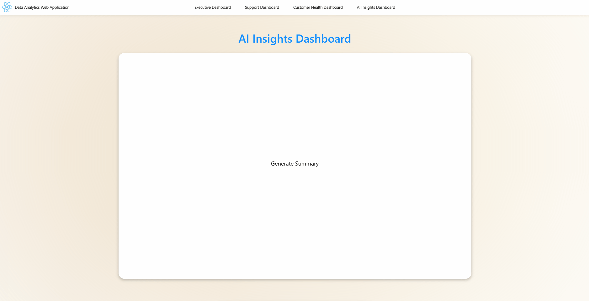
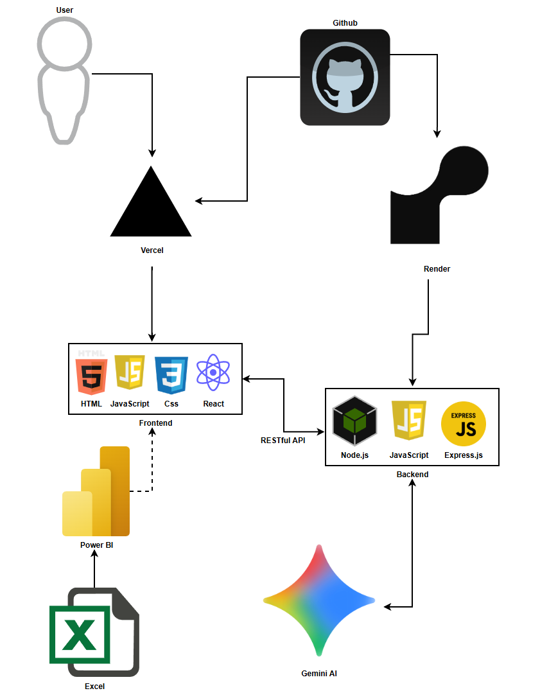

# Data Analytics Web Application

This project is a full-stack customer analytics platform built using Power BI, React, Node.js, Express, and RESTful APIs. 
A synthetic customer dataset containing over 500 records was created in Excel, transformed using Power Query, and analyzed through multiple Power BI dashboards. 
The React frontend provides an intuitive interface for navigating executive, customer support, customer health, and AI insights dashboards.

The application integrates Google's Gemini AI through REST APIs to analyze dashboard data and generate executive summaries, business insights, and strategic recommendations. 
This project demonstrates business intelligence, data analytics, full-stack web development, API integration, and applied AI in a realistic business environment.

---

## Application Preview

### Application Navigation

### AI-generated Business Insights

---

## Technical Skills Demonstrated
- Excel Data Modeling and Dataset Creation
- Power Query Data Transformation
- DAX Measures and Calculated Columns
- Data Visualization and Reporting
- Power BI Dashboard Development
- React Frontend Development
- JavaScript Development
- Node.js Backend Development
- RESTFUL API Development
- Frontend/Backend Integration
- Asynchronous Programming (Fetch API, Async/Await)
- AI and Large Language Model (LLM) Integration
- Full-Stack Application Architecture

---

## Development Pipeline

### Excel Dataset Creation
Purpose: Create a realistic customer analytics dataset
- Generated 500+ synthetic customer records
- Included customer satisfaction, purchases, support interactions, and regional data
- Served as the foundation for business analysis

↓

### Power Query Data Transformation
Purpose: Clean and prepare data for reporting
- Removed Inconsistencies (Added relevant columns or deleted garbage data)
- Cleaned data formats
- Created analysis ready datasets

↓

### Power BI Dashboard Development
Purpose: Transform data into dashboard reports
- Developed DAX measures and calculated columns to generate business metrics
- Created Executive, Customer Support, and Customer Health dashboards
- Designed dashboards to support business decision-making through interactive reports

↓

### React Frontend
Purpose: Deliver dashboards through modern web application
 
Most Relevant Files: [AppContent.jsx](src/AppContent.jsx), [Insights.jsx](src/pages/Insights.jsx)
- Developed frontend with JavaScript and React library
- Built reusable React components with useState and useEffect
- Implemented routing with React Router
- Added animations using Framer Motion
- Created responsive dashboard navigation

    

↓

### Node.js, Express & REST APIs
Purpose: Process AI requests and connect frontend services
 
Relevant Files: [server.js](backend/server.js)
- Developed backend services using JavaScript, Node.js, and Express
- Created RESTful API endpoints to handle frontend requests
- Utilized async/await and the Fetch API for asynchronous operations
- Integrated Google Gemini AI to generate business insights
- Implemented secure client-server communication using CORS

↓

### Gemini AI Integration
Purpose: Generate automated business insights
 
Relevant Files: [server.js](backend/server.js)
- Analyzed dashboard screenshots
- Generated executive summaries
- Identified customer trends
- Produced strategic recommendations

---

## System Architecture

---

## How To Run

Link: http://power-bi-web-application.vercel.app

---

## Author
Anthony Klimas  
Computer Science Major  
Mathematics Minor  
University of Massachusetts Lowell  

