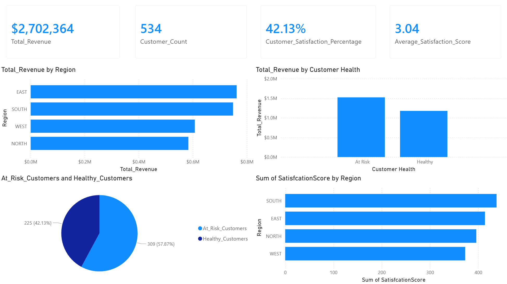
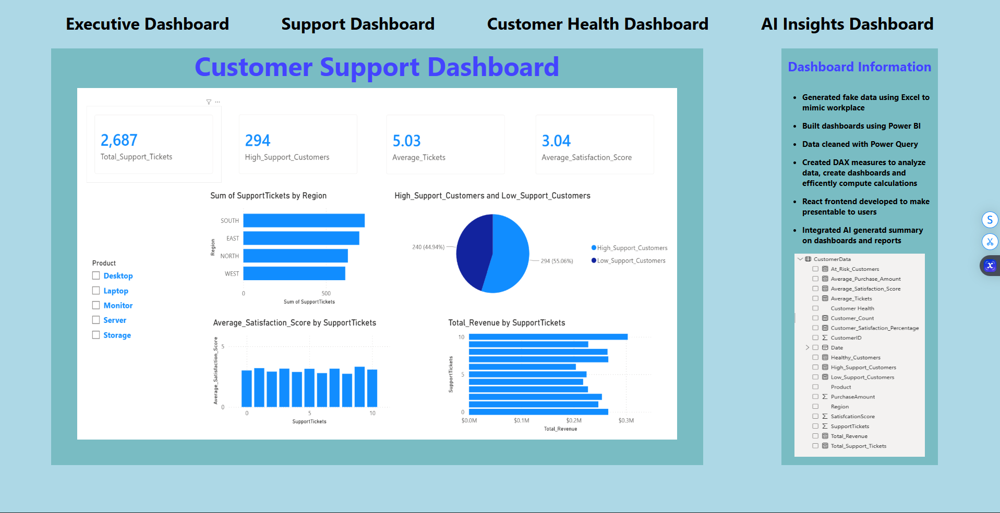
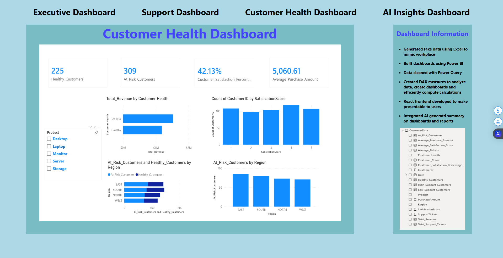
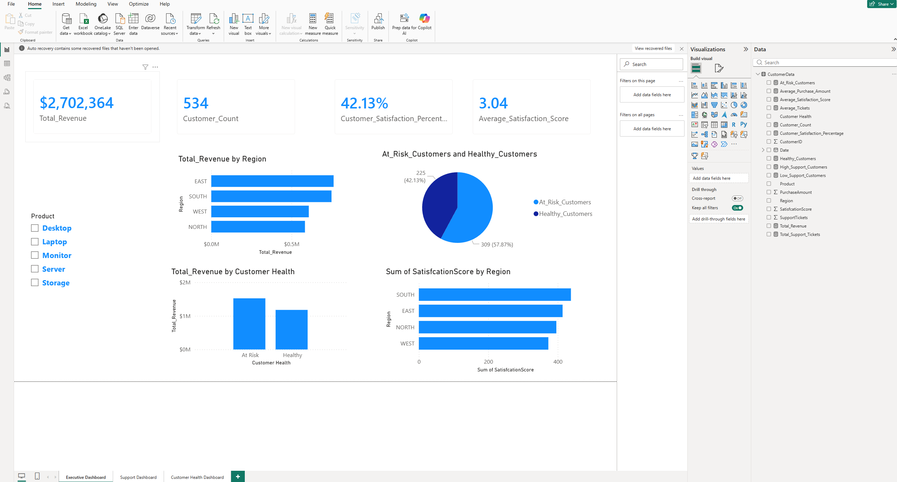

# Full-Stack Power BI React Web Application

This project is a full-stack customer analytics platform built using Power BI, React, Node.js, Express, and RESFUL APIs. 
A synthetic customer dataset containing over 500 records was created in Excel and transformed using Power Query before being analyzed through multiple Power BI dashboards. 
A React frontend was developed to provide an interactive and user-friendly interface for navigating executive, customer support, and customer health dashboards. The application also integrates Gemini AI through 
RESTful APIs to analyze dashboard images and generate executive summaries, business insights, and strategic recommendations. 
This project demonstrates data analytics, business intelligence, full-stack web development, and AI integration in a real-world business scenario.

---

## Application Preview

### Executive Dashboard

### Customer Support Dashboard

### Customer Health Dashboard

### PowerBI User Interface

---

## Technical Skills Demonstrated
- Data Analysis and Buisness Intelligence
- Power BI Dashboard Development
- Power Query Data Transformation
- DAX Measures and Calculated Columns
- Data Visualization and Reporting
- React Frontend Development
- JavaScript Programming
- Node.js Backend Development
- Express REST API Development
- Frontend/Backend Integration
- Asynchronous Programming (Fetch API, Async/Await)
- AI and Large Language Model (LLM) Integration
- RESTFUL API development
- Full-Stack Application Architecture
- Git and GitHub Version Control

---

## Technologies and Concepts Explained

### Power BI
- Imported and transformed an Excel customer dataset using Power Query
- Cleaned, organized, and prepared data for analysis and reporting
- Developed DAX measures and calculated columns to generate business metrics
- Created Executive, Customer Support, and Customer Health dashboards
- Designed dashboards to support business decision-making through interactive reports

### React
- Developed a web application to present PowerBI dashboards through an intuitive user interface
- Implemented component-based architecture to create reusable UI elements and pages
- Utilized React Router to provide navigation between dashboard views and AI insights
- Managed application state using React Hooks such as useState
- Dynamically updated UI content based on API responses from the backend
- Created a responsive dashboard experience that separates presentation logic from backend services

### JavaScript
- Implemented frontend application logic and user interactions
- Utilized asynchronous programming concepts with async/await and the Fetch API
- Processed API responses and dynamically updated dashboard content
- Managed user-triggered events such as generating AI-powered executive summaries
- Integrated frontend components with backend REST API endpoints
- Applied modern ES6+ JavaScript syntax and programming practices

### Node.js, Express, and REST APIs
- Developed a backend server using Node.js and Express
- Created RESTful API endpoints to handle frontend requests
- Implemented client-server communication between the React frontend and Express backend
- Integrated Google Gemini AI to analyze dashboard images and generate business insights
- Processed multiple dashboard images through AI-powered image analysis workflows
- Utilized middleware such as CORS to enable secure communication between frontend and backend services
- Designed a scalable backend architecture capable of supporting future analytics and AI features

---

## Features
- Interactive Executive, Customer Support, and Customer Health dashboards built in Power BI
- React-based frontend for dashboard navigation and presentation
- AI-generated executive summaries powered by Google Gemini
- RESTful API communication between React frontend and Express backend
- Customer satisfaction, revenue, and support ticket analysis

---

## Architecture

Front-End Infrastructure:
- React single-page application
- React Router for client-side navigation between dashboards
- JavaScript and JSX component architecture
- CSS-based user interface styling and layout
- Dashboard image presentation and AI insights interface

Back-End Infrastructure:
- Node.js runtime environment
- Express server for RESTful API endpoints
- CORS middleware for frontend/backend communication
- Google Gemini AI integration for dashboard image analysis
- Environment variable configuration using dotenv
- File system processing for dashboard image retrieval and AI analysis

Data & Analytics Infrastructure:
- Microsoft Excel dataset containing 500+ customer records
- Power Query data cleaning and transformation workflows
- DAX measures and calculated columns
- Power BI Executive Dashboard
- Power BI Customer Support Dashboard
- Power BI Customer Health Dashboard
- AI-generated executive summaries and business recommendations

---

## How To Run

Link:

---

## Author
Anthony Klimas  
Computer Science Major  
Mathematics Minor  
University of Massachusetts Lowell  

